# iMapVietnam — API Flow Diagrams

Tài liệu này mô tả luồng xử lý của từng nhóm API đang có trong hệ thống.

---

## 1. Auth Flows

### 1a. Đăng ký / Đăng nhập

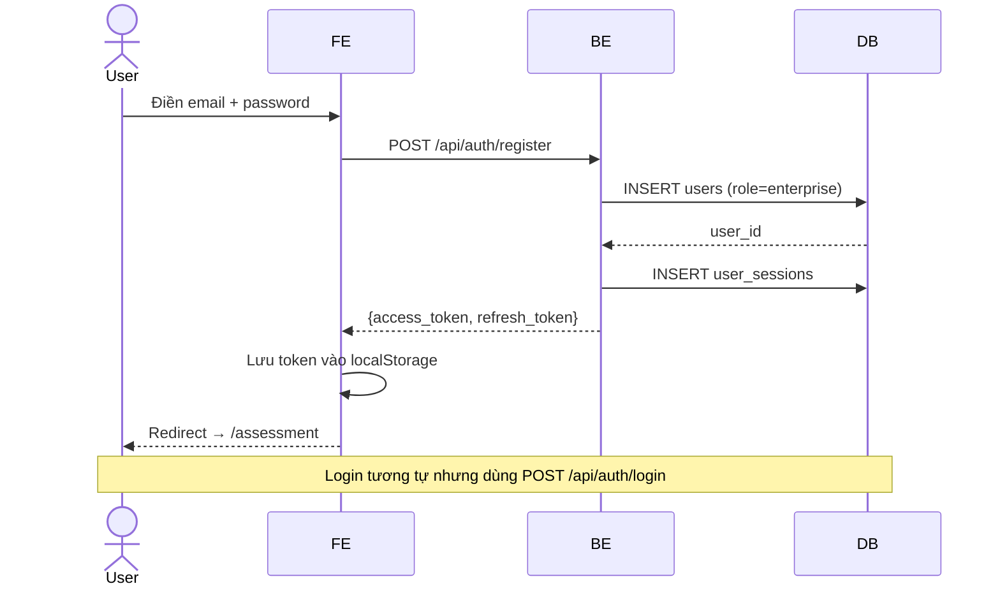

### 1b. Google OAuth

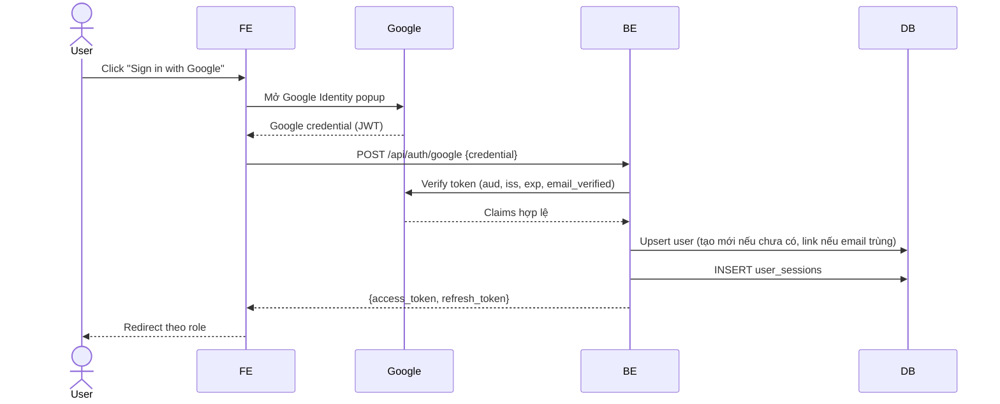

### 1c. Token Refresh (tự động)

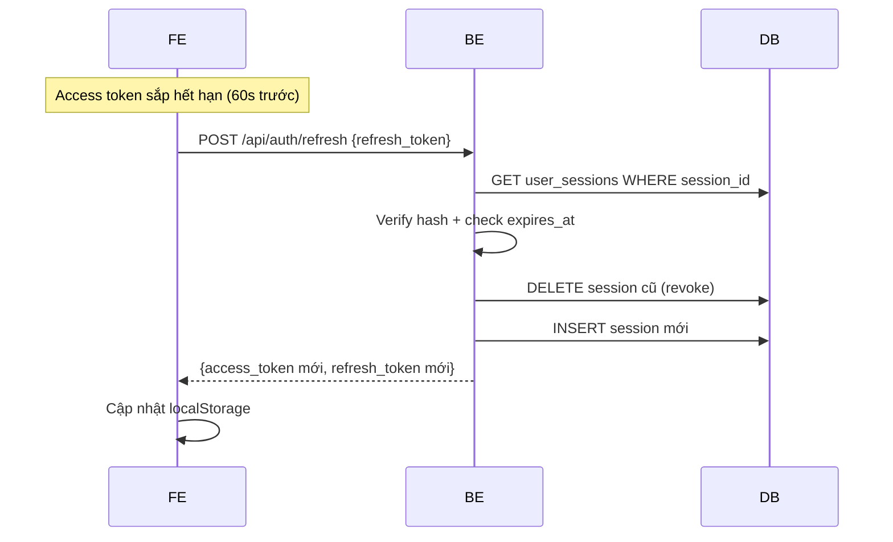

### 1d. Setup Admin (một lần duy nhất)

```mermaid
flowchart TD
    A[POST /api/auth/setup-admin] --> B{SETUP_ADMIN_SECRET\nkhớp env?}
    B -- Không --> C[401 Unauthorized]
    B -- Có --> D{Đã có admin\nactive?}
    D -- Có --> E[409 Conflict]
    D -- Chưa --> F[Hash password\nbcrypt]
    F --> G[INSERT users\nrole=admin]
    G --> H[200 OK\n{user_id, email, role}]
    H --> I[Gọi POST /api/auth/login\nđể lấy token]
```

---

## 2. Enterprise Catalog Flows

### 2a. Public List + Search

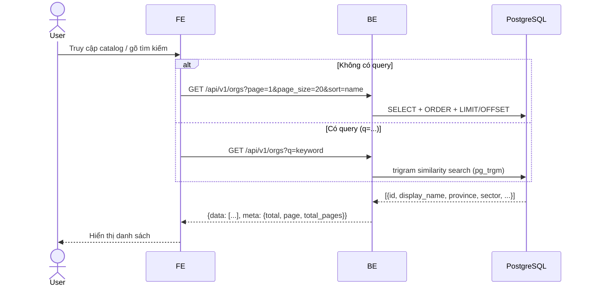

### 2b. Enterprise Detail Tiers

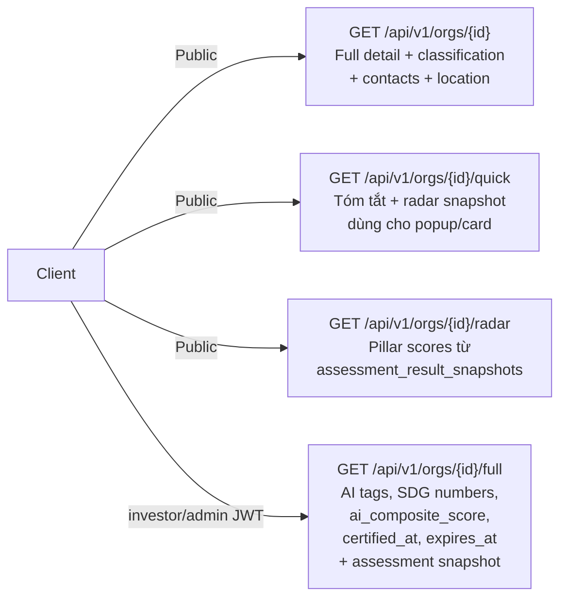

### 2c. Self-Registration (Enterprise)

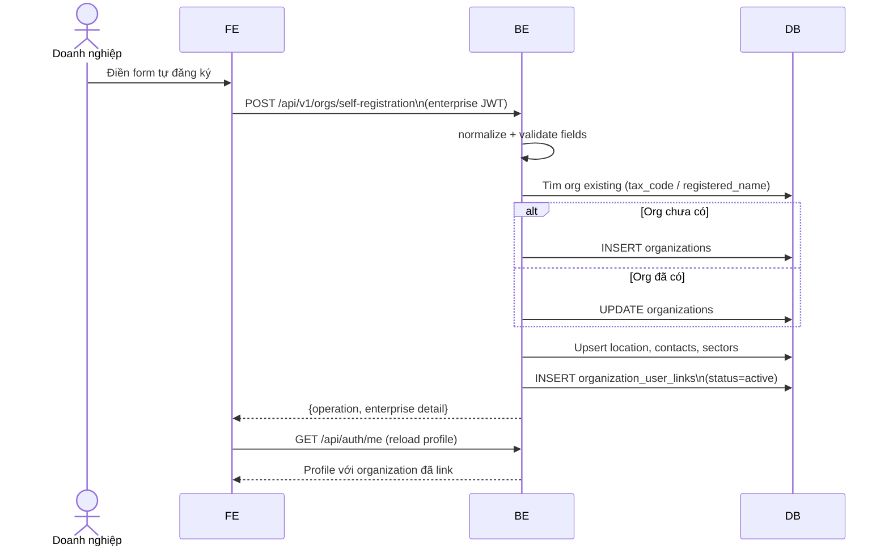

---

## 3. Map Flows

### 3a. Dual-mode Map (FE logic)

```mermaid
flowchart TD
    A[User mở MapPage] --> B{Có filter\nđang active?}
    B -- Không --> C[GET /api/v1/map/pins\nLean pins: id+lat+lng+status\nKhông auth, staleTime 5 phút]
    B -- Có --> D[GET /api/map/enterprises\nFull GeoJSON + filter + bbox]
    C --> E[Render tất cả markers\nClick → load quick profile]
    D --> F[Render filtered markers\nPopup có display_name]
    E --> G{User click marker}
    F --> G
    G --> H[GET /api/v1/orgs/{id}/quick\nHiển thị panel bên phải]
```

### 3b. Map Pins vs Map Enterprises

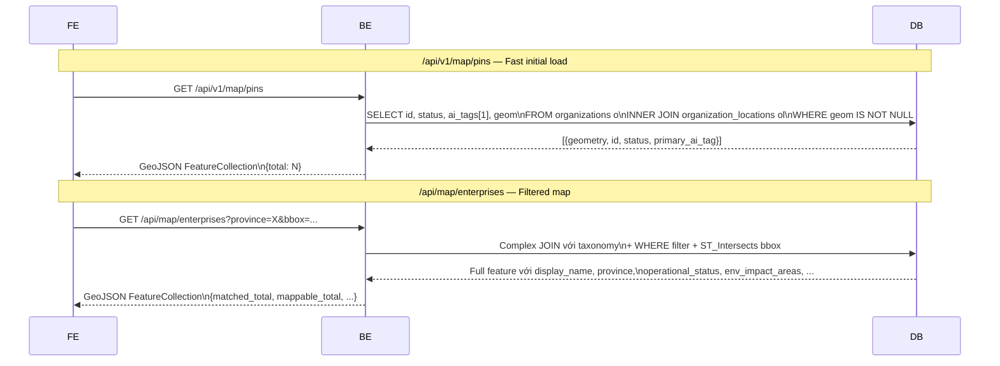

---

## 4. Claim Workflow

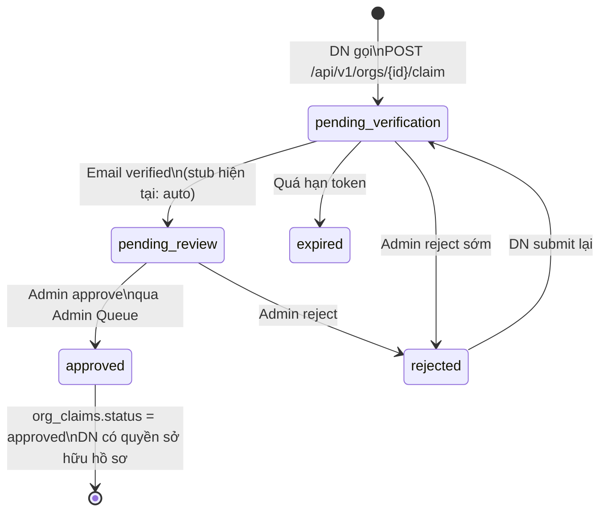

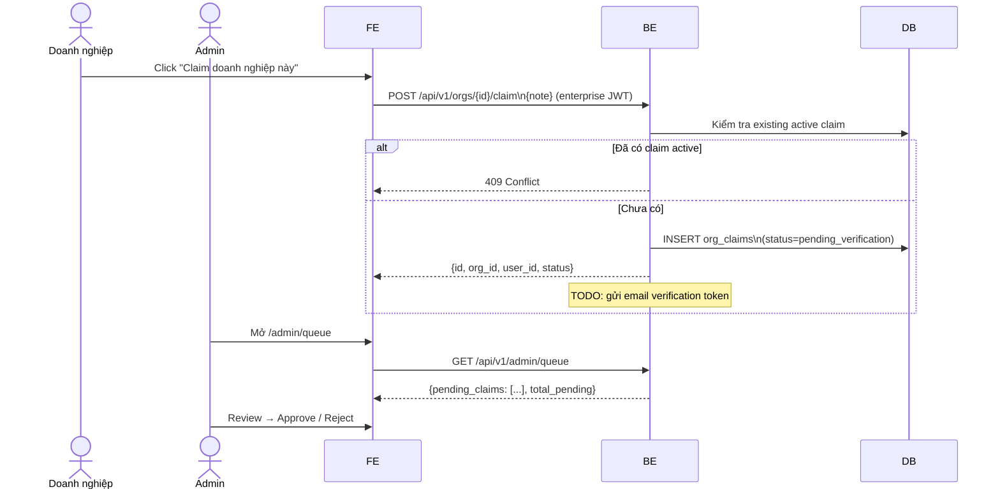

---

## 5. Assessment Flows

### 5a. Legacy Assessment (assessment_submissions)

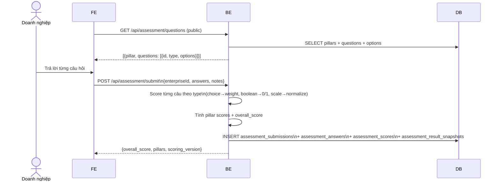

### 5b. Assessment v2 — Auto-save Draft (assessments table)

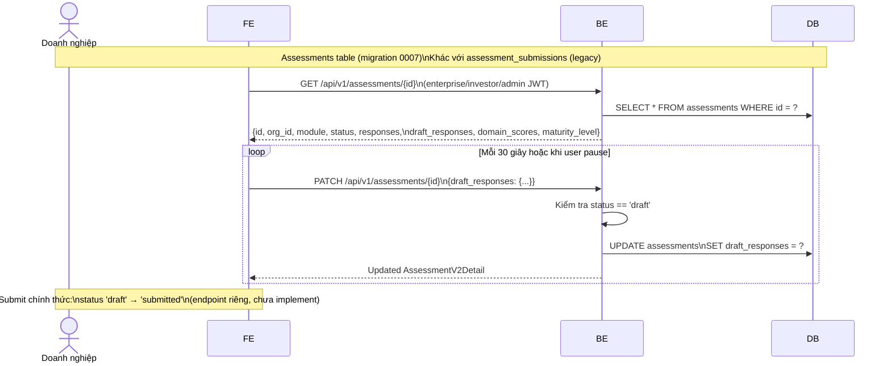

---

## 6. Certification Flows

### 6a. DN Apply → Admin Review (legacy flow)

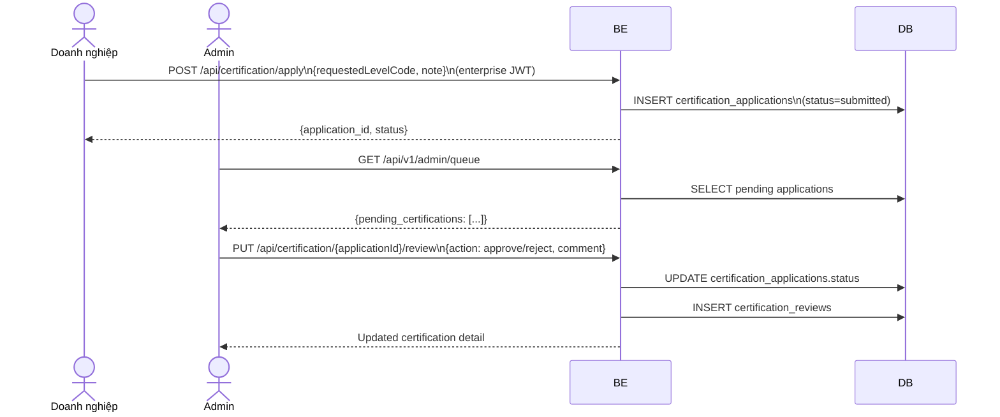

### 6b. Admin Issue Certification v2 + Two-Person Rule

```mermaid
flowchart TD
    A[POST /api/v1/admin/certifications/{id}\n{star_rating, notes}] --> B{star_rating == 5?}

    B -- Không 1-4 sao --> C[UPDATE organizations\nstatus=certified, star_rating]
    C --> D[INSERT/UPDATE certifications\nstatus=active, directory_visible=TRUE]
    D --> E[INSERT audit_log\nevent=CERT_ISSUED]
    E --> F[200 OK\n{status: certified, audit_id}]

    B -- Có 5 sao --> G[UPDATE organizations\nstatus=registered temporarily]
    G --> H[INSERT/UPDATE certifications\nstatus=pending_second_approval\nfirst_approver_id=actor]
    H --> I[202 Accepted\n{status: pending_second_approval\nrequires_second_approval: true}]

    I --> J[Admin 2 khác gọi\nPOST /certifications/{id}/approve-second]
    J --> K{actor == first_approver?}
    K -- Có --> L[409 Conflict]
    K -- Không --> M[UPDATE certifications\nstatus=active\nsecond_approver_id=actor2]
    M --> N[UPDATE organizations\nstatus=certified]
    N --> O[INSERT audit_log\nevent=CERT_ISSUED\ntwo_person_rule=true]
    O --> P[200 OK\n{status: certified}]
```

---

## 7. Admin Flows

### 7a. Score Override

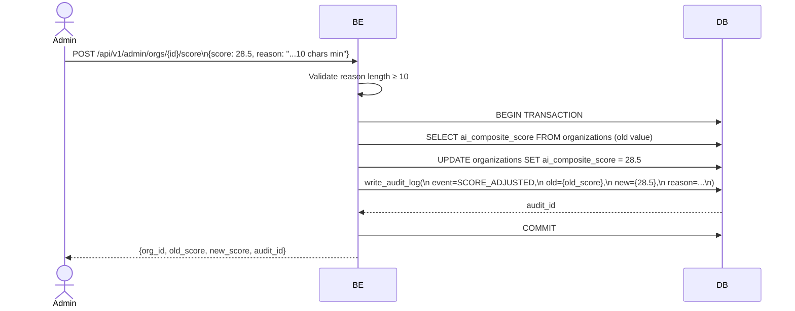

### 7b. Admin Queue

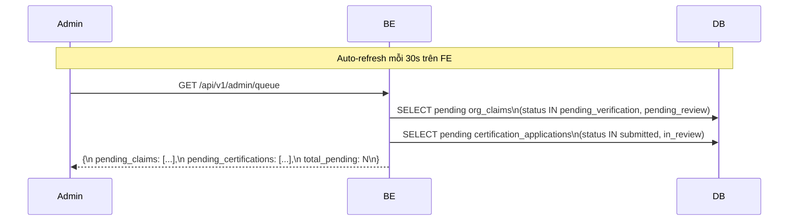

---

## 8. Insights & Dashboard Flows

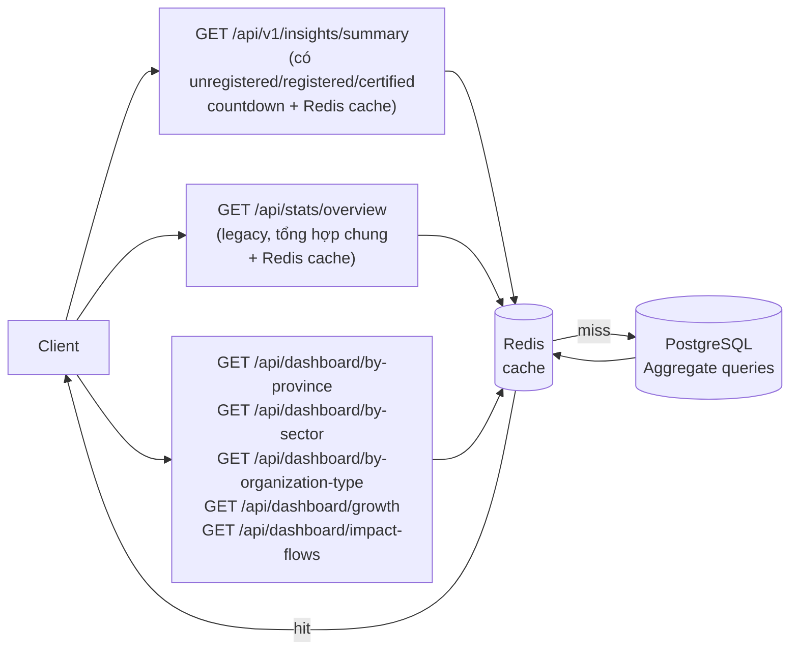

---

## 9. Rate Limiting (middleware)

```mermaid
flowchart TD
    A[Request đến] --> B{Redis available?}
    B -- Không --> C[Fallback: Allow\nkhông block traffic]
    B -- Có --> D{Có Bearer token?}

    D -- Không --> E[Key: rl:ip:{client_ip}\nLimit: 100 req/min]
    D -- Có --> F[Key: rl:auth:{client_ip}\nLimit: 1000 req/min]

    E --> G[Redis sliding window\nZADD + ZCOUNT\n60 second window]
    F --> G

    G --> H{count > limit?}
    H -- Có --> I[429 Too Many Requests\nRetry-After header]
    H -- Không --> J[Request tiếp tục\nX-RateLimit-Remaining header]
```

---

## 10. Request Lifecycle tổng quát

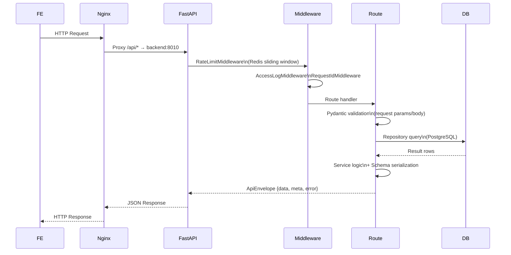

---

## Phân quyền theo nhóm

```mermaid
flowchart TD
    Req[API Request] --> Auth{Bearer token?}

    Auth -- Không --> Public[Public endpoints:\nGET /api/v1/orgs\nGET /api/v1/map/pins\nGET /api/v1/insights/summary\nGET /api/dashboard/*\nGET /api/taxonomies\nGET /api/certification/directory\nGET /api/news\nGET /api/iid/*]

    Auth -- Có --> Decode[Decode JWT\n→ role_code]

    Decode --> Enterprise{role == enterprise?}
    Decode --> Investor{role == investor?}
    Decode --> Admin{role == admin?}

    Enterprise --> EntRoutes[POST /api/v1/orgs/{id}/claim\nPATCH /api/v1/assessments/{id}\nPOST /api/assessment/submit\nPOST /api/certification/apply]

    Investor --> InvRoutes[GET /api/v1/orgs/{id}/full\nGET /api/v1/assessments/{id}]

    Admin --> AdminRoutes[Tất cả enterprise + investor routes\n+\nGET /api/v1/admin/queue\nPOST /api/v1/admin/orgs/{id}/score\nPOST /api/v1/admin/certifications/{id}\nPOST /api/news\nPUT /api/iid/about\n+ tất cả write endpoints]
```
